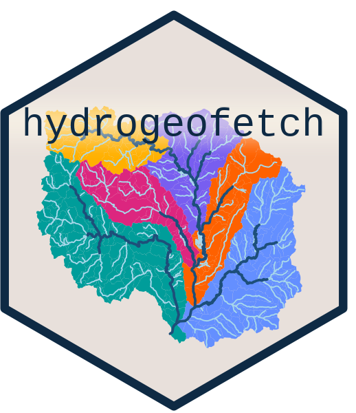

---
output:
  github_document:
    html_preview: false
---

<!-- README.md is generated from README.Rmd. Please edit that file -->

```{r, include = FALSE}
knitr::opts_chunk$set(
  collapse = TRUE,
  comment = "#>",
  fig.path = "man/figures/README-",
  out.width = "100%"
)
```

# hydrogeofetch 

 [](https://app.codecov.io/gh/doi-usgs/nhdplusTools) [](https://cran.r-project.org/package=nhdplusTools) [](https://cran.r-project.org/package=nhdplusTools)

## Renamed from `nhdplusTools`

`hydrogeofetch` (hydrologic geospatial fabric extraction tool chain) is the renamed successor to `nhdplusTools`. The package scope has grown beyond NHDPlus, and the new name reflects that broader role. All functions, signatures, and behavior carry over unchanged.

`nhdplusTools` will remain on CRAN as a deprecation shim forwarding calls to `hydrogeofetch` until **October 2028**, at which point it will be archived. Archived packages stay installable from the CRAN archive, so code pinned to `nhdplusTools` will continue to run.

## hydrogeofetch: Tools for Accessing and Working with the NHDPlus and other US hydrographic data.

## Major changes in 2.0.0

Indexing, network navigation, and network attribute functions have moved to [**hydroloom**](https://doi-usgs.github.io/hydroloom/). hydrogeofetch is now focused on data access and NHD-specific preparation; hydroloom handles the general-purpose network analysis that was previously bundled here.

If you use any of the following, you now need `library(hydroloom)`:

- **Indexing** (`get_flowline_index`, `get_waterbody_index`, `disambiguate_flowline_indexes`) → [`hydroloom::index_points_to_lines()`](https://doi-usgs.github.io/hydroloom/reference/index_points_to_lines.html), [`index_points_to_waterbodies()`](https://doi-usgs.github.io/hydroloom/reference/index_points_to_waterbodies.html), [`disambiguate_indexes()`](https://doi-usgs.github.io/hydroloom/reference/disambiguate_indexes.html)
- **Navigation** (`get_UT`, `get_DM`, `get_UM`, `get_DD`, `navigate_network`) → [`hydroloom::navigate_hydro_network()`](https://doi-usgs.github.io/hydroloom/reference/navigate_hydro_network.html)
- **Network attributes** (`get_streamorder`, `get_levelpaths`, `get_pathlength`, `calculate_total_drainage_area`, etc.) → hydroloom's [`add_streamorder()`](https://doi-usgs.github.io/hydroloom/reference/add_streamorder.html), [`add_levelpaths()`](https://doi-usgs.github.io/hydroloom/reference/add_levelpaths.html), [`add_pathlength()`](https://doi-usgs.github.io/hydroloom/reference/add_pathlength.html), [`accumulate_downstream()`](https://doi-usgs.github.io/hydroloom/reference/accumulate_downstream.html)

The typical workflow is now: use hydrogeofetch to fetch and prepare NHD data, then hand off to hydroloom for indexing, navigation, and network analysis. See `vignette("migrating_from_nhdplusTools")` for a complete mapping of old to new function names.

### Recommended Citation:

```
Blodgett, D. 2026, hydrogeofetch: Hydrologic Geospatial Fabric Data Extraction Tool Chain, https://doi.org/10.5066/P13UWPUR
```

### Installation:

```{r, eval = FALSE}
install.packages("nhdplusTools")
```

For the latest development:
```{r, eval = FALSE}
install.packages("remotes")
remotes::install_github("DOI-USGS/nhdplusTools")
```

### Resources

For data discovery and access in a U.S. context, start with the [**Getting Started page**](https://doi-usgs.github.io/nhdplusTools/articles/nhdplusTools.html).

Detailed documentation of all the package functions can be found at the [**Reference page**](https://doi-usgs.github.io/nhdplusTools/reference/).

### Data:

`hydrogeofetch` provides easy access to data associated with the U.S. National Hydrography Dataset. Network analysis and spatial indexing live in [`hydroloom`](https://doi-usgs.github.io/hydroloom/).

## Package Vision

The `hydrogeofetch` package provides tools to discover, download, subset, and 
prepare U.S. NHDPlus data. Network analysis (navigation, indexing, attribute 
generation) belongs in [`hydroloom`](https://doi-usgs.github.io/hydroloom/).

General, globally applicable functionality has been moved to [`hydroloom`](https://doi-usgs.github.io/hydroloom/).

`hydrogeofetch` implements a data model consistent with both the [NHDPlus](https://www.epa.gov/waterdata/nhdplus-national-hydrography-dataset-plus)
dataset and the [HY\_Features](http://opengeospatial.github.io/HY_Features/) data
model. The package aims to provide a set of tools that can be used to build
workflows using NHDPlus data.

**This vision is intended as a guide to contributors -- conveying what kinds of
contributions are of interest to the package's long term vision. It is a
reflection of the current thinking and is open to discussion and modification.**

### Functional Vision
The following describe a vision for the functionality that should be included
in the package in the long run.

##### Subsetting
The NHDPlus is a very large dataset both spatially and in terms of the number
of attributes it contains. Subsetting utilities will provide network location
discovery, network navigation, and data export utilities to generate spatial
and attribute subsets of the NHDPlus dataset.

##### Indexing
Indexing data to the hydrographic network (linear referencing and catchment 
indexing) is handled by [`hydroloom`](https://doi-usgs.github.io/hydroloom/).
`hydrogeofetch` provides the data access needed to set up indexing workflows.

### Data Model
Given that `hydrogeofetch` is focused on working with NHDPlus data, the NHDPlus
data model will largely govern the data model the package is designed to work
with. That said, much of the package functionality also uses concepts from
the HY\_Features standard.  

*Note:* The HY\_Features standard is based on the notion that a "catchment" is a
holistic feature that can be "realized" (some might say modeled) in a number of
ways. In other words, a catchment can *only* be characterized fully through a
collection of different conceptual representations. In NHDPlus, the "catchment"
feature is the polygon feature that describes the drainage divide around the
hydrologic unit that contributes surface flow to a given NHD flowline. While this
may seem like a significant difference, in reality, the NHDPlus COMID identifier
lends itself very well to the HY\_Features catchment concept. The COMID is
used as an identifier for the catchment polygon, the flowline that
connects the catchment inlet and outlet, and value added attributes that
describe characteristics of the catchment's interior. In this way, the COMID
identifier is actually an identifier for a collection of data that
together fully describe an NHDPlus catchment. [See the NHDPlus mapping to
HY_Features in the HY_Features specification.](https://docs.ogc.org/is/14-111r6/14-111r6.html#annexD_1)

Below is a description of the scope of data used by the
`hydrogeofetch` package. While other data and attributes may come into scope,
it should only be done as a naive pass-through, as in data subsetting, or
with considerable deliberation.

##### Flowlines and Waterbodies
Flowline geometry is a mix of 1-d streams and 1-d "artificial paths". In order
to complete the set of features meant to represent water, we need to include
waterbody polygons.

##### Catchment Polygons
Catchment polygons are the result of a complete elevation derived hydrography
process with hydro-enforcement applied with both Watershed Boundary Dataset
Hydrologic Units and NHD reaches.

##### Network Attributes
The NHDPlus includes numerous attributes that are built using the network and
allow a wide array of capabilities that would require excessive iteration or
sophisticated and complex graph-oriented data structures and algorithms.

### Architecture
The NHDPlus is a very large dataset. The architecture of this package as it
relates to handling data and what dependencies are used will be very important.

##### Web vs Local Data
`hydrogeofetch` offers a mix of web service and local data functionality.
Web services have generally been avoided for large processes. However, 
applications that would require loading significant amounts of data to perform 
something that can be accomplished with a web service very quickly are supported.
Systems like the [Network Linked Data Index](https://waterdata.usgs.gov/blog/nldi-intro/) are
used for data discovery.

##### NHDPlus Version
Initial package development focused on the [National Seamless NHDPlus](https://www.epa.gov/waterdata/nhdplus-national-data)
database. [NHDPlus High Resolution](https://www.usgs.gov/national-hydrography/nhdplus-high-resolution) is also supported.

### Related similar packages:
https://github.com/mbtyers/riverdist  
https://github.com/jsta/nhdR  
https://github.com/lawinslow/hydrolinks  
https://github.com/mikejohnson51/HydroData    
https://github.com/ropensci/FedData    
https://github.com/hyriver/pygeohydro
... others -- please suggest additions?

### Build and release:

Development happens on GitHub (doi-usgs/nhdplusTools). Official builds and release candidates are produced on code.usgs.gov (code.usgs.gov/water/nhdplusTools) using GitLab CI.

**Vignettes** use the `BUILD_VIGNETTES` environment variable to control code evaluation. Set `BUILD_VIGNETTES=TRUE` in a local `.Renviron` to build vignettes with live code. Without it, vignettes render with static output only. An additional `BUILD_VIGNETTES_CRAN=TRUE` variable controls image size in the drainage area vignette.

**Local development** does not require building the source package. Use `devtools::test()`, `devtools::check()`, and `devtools::document()` directly.

**Release candidates** are built on code.usgs.gov. Push a branch named `rc/<version>` (e.g. `rc/2.0.0`) to trigger the GitLab CI pipeline, which runs three stages:

1. **check** -- lightweight structural check (no tests, no examples, no vignettes). Gates the rest of the pipeline.
2. **build** -- `R CMD build .` to produce the source tarball. Uploads the tarball to the GitLab generic package registry.
3. **verify** -- `R CMD check --as-cran` on the built tarball.

Once the pipeline passes, download the tarball from the package registry and submit it to CRAN. The tarball that CRAN receives is the exact artifact that passed `--as-cran` in CI.

### Release checklist:
- All checks pass and code coverage is adequate
- NEWS.md is up to date
- Disclaimer is in [released form](https://code.usgs.gov/water/sbtools/-/blob/v1.1.14/README.md#L113)
- Version updated in inst/CITATION and code.json
- Push `rc/<version>` branch to code.usgs.gov and confirm pipeline passes
- Download tarball from GitLab package registry and submit to CRAN
- After CRAN acceptance:
  - Ensure pkgdown is up to date
  - Commit, push, and PR/MR changes
  - Create release page and tag
  - Attach CRAN tar.gz to release page
  - Update DOI to point to release page
  - Switch README disclaimer back to ["dev" mode](https://code.usgs.gov/water/sbtools#disclaimer)
  - Bump version in DESCRIPTION


### Contributing:

First, thanks for considering a contribution! I hope to make this package a community created resource
for us all to gain from and won't be able to do that without your help!

1) Contributions should be thoroughly tested with [`testthat`](https://testthat.r-lib.org/).  
2) Code style should attempt to follow the [`tidyverse` style guide.](https://style.tidyverse.org/)  
3) Please attempt to describe what you want to do prior to contributing by submitting an issue.  
4) Please follow the typical github [fork - pull-request workflow.](https://gist.github.com/Chaser324/ce0505fbed06b947d962)  
5) Make sure you use roxygen and run Check before contributing. More on this front as the package matures. 

Other notes:
- consider running `lintr` prior to contributing.
- consider running `goodpractice::gp()` on the package before contributing.
- consider running `devtools::spell_check()` if you wrote documentation.
- this package uses pkgdown. Running `pkgdown::build_site()` will refresh it.

```{r disclaimer, child="DISCLAIMER.md", eval=TRUE}

```

 [
    
  ](https://creativecommons.org/publicdomain/zero/1.0/)
