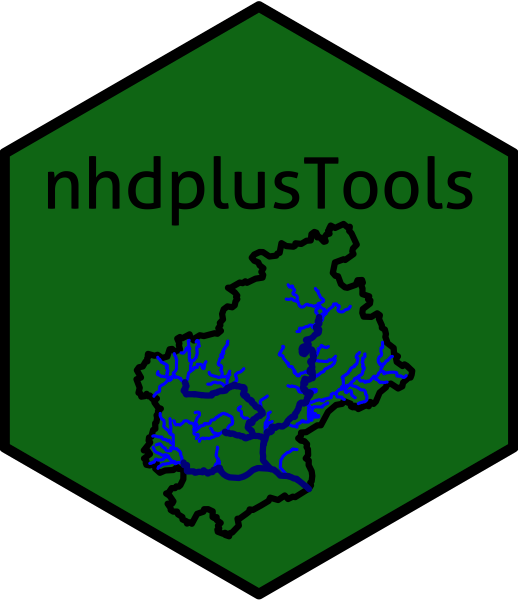

# nhdplusTools 

 [](https://app.codecov.io/gh/usgs-r/nhdplusTools) [](https://cran.r-project.org/package=nhdplusTools) [](https://cran.r-project.org/package=nhdplusTools)

## nhdplusTools: Tools for Accessing and Working with the NHDPlus

This package is a growing set of tools for manipulation of hydrographic
data using the NHDPlus data model. There is no specific
funding or plan to continue development of this package long term
but ongoing support is available due to use of the package in project work.

### Recommended Citation:

```
  Blodgett, D., Johnson, J.M., 2022, nhdplusTools: Tools for
  Accessing and Working with the NHDPlus,
  https://doi.org/10.5066/P97AS8JD
```

### Installation:

```
install.packages("nhdplusTools")
```

For the latest development:
```
install.packages("remotes")
remotes::install_github("USGS-R/nhdplusTools")
```

### Resources
See the ["Get Started"](https://usgs-r.github.io/nhdplusTools/articles/nhdplusTools.html) vignette showing the gneral workflow and functionality of nhdplusTools.  
See a set of [slides](https://usgs-r.github.io/nhdplusTools/awra_2019/) illustrating how to use nhdplusTools with other USGS-R packages.

### Terminology: 

The following definitions have been used as much as possible throughout the package.  
Terms for rivers:  
**Flowline:** The NHD name for a hydrographic representation of a flowing body of water. Flowline is generally used when referring to geometry.  
**Flowpath:** The HY_Features name for a hydrologic feature that is the primary path water follows through a catchment; either from headwater to outlet or inlet to outlet. Flowpath is used when describing aspects of the abstract flowpath featuretype, generally in relation to a flowpath's relationship to a catchment.  

Terms used for hydrologic units:  
**Catchment:** The most abstract unit of hydrology in HY_Features is the catchment. It is a physiographic unit with zero or one inlets and one outlet. It does not inherently have any conceptual realizations. Rather, a given catchment can be realized in a number of ways; flowpath, divide, and networks of flowpaths and divides are the primary realizations.  
**Catchment divide:** NHD "catchment" polygons are more accurately described as "catchment divide" features. Because of the overlap with the HY_Features abstract "catchment" feature type, "catchment divide" is used for polygon representations of catchments.

### Data:

[A National Dataset of NHDPlusV2.1 is available here.](https://www.epa.gov/waterdata/nhdplus-national-data)  

For data subsetting, also see: [`get_nhdplus`](https://usgs-r.github.io/nhdplusTools/reference/get_nhdplus.html), [`subset_nhdplus`](https://usgs-r.github.io/nhdplusTools/reference/subset_nhdplus.html), [`navigate_network`](https://usgs-r.github.io/nhdplusTools/reference/navigate_network.html), [`download_nhdplushr`](https://usgs-r.github.io/nhdplusTools/reference/download_nhdplushr.html) and [`get_nhdplushr`](https://usgs-r.github.io/nhdplusTools/reference/get_nhdplushr.html)

## Package Vision

The `nhdplusTools` package is intended to provide a reusable set of tools to
subset, relate data to, and generate network attributes for NHDPlus data. 

It implements a data model consistent with both the [NHDPlus](https://www.epa.gov/waterdata/nhdplus-national-hydrography-dataset-plus)
dataset and the [HY\_Features](http://opengeospatial.github.io/HY_Features/) data 
model. The package aims to provide a set of tools that can be used to build 
workflows using NHDPlus data.

**This vision is intended as a guide to contributors -- conveying what kinds of
contributions are of interest to the package's long term vision. It is a
reflection of the current thinking and is open to discussion and modification.**

### Functional Vision
The following describe a vision for the functionality that should be included
in the package in the long run.

##### Subsetting
The NHDPlus is a very large dataset both spatially and in terms of the number
of attributes it contains. Subsetting utilities will provide network location
discovery, network navigation, and data export utilities to generate spatial
and attribute subsets of the NHDPlus dataset.

##### Indexing
One of the most important roles of the NHDPlus is as a connecting network for
ancillary data and models. The first step in any workflow that uses the
network like this is indexing relevant data to the network. A number of methods
for indexing exist, they can be broken into two main categories: linear
referencing and catchment indexing. Both operate on features represented by
points, lines, and polygons. `nhdplusTools` should eventually support both
linear and catchment indexing.

### Data Model
Given that `nhdplusTools` is focused on working with NHDPlus data, the NHDPlus
data model will largely govern the data model the package is designed to work
with. That said, much of the package functionality also uses concepts from
the HY\_Features standard.  

*Note:* The HY\_Features standard is based on the notion that a "catchment" is a
holistic feature that can be "realized" (some might say modeled) in a number of
ways. In other words, a catchment can *only* be characterized fully through a
collection of different conceptual representations. In NHDPlus, the "catchment"
feature is the polygon feature that describes the drainage divide around the
hydrologic unit that contributes surface flow to a given NHD flowline. While this
may seem like a significant difference, in reality, the NHDPlus COMID identifier
lends itself very well to the HY\_Features catchment concept. The COMID is
used as an identifier for the catchment polygon, the flowline that
connects the catchment inlet and outlet, and value added attributes that
describe characteristics of the catchment's interior. In this way, the COMID
identifier is actually an identifier for a collection of data that
together fully describe an NHDPlus catchment. [See the NHDPlus mapping to
HY_Features in the HY_Features specification.](http://docs.opengeospatial.org/is/14-111r6/14-111r6.html#annexD_1)

Below is a description of the expected scope of data to be used by the
`nhdplusTools` package. While other data and attributes may come into scope,
it should only be done as a naive pass-through, as in data subsetting, or
with considerable deliberation.

##### Flowlines and Waterbodies
Flowline geometry is a mix of 1-d streams and 1-d "artificial paths". In order
to complete the set of features meant to represent water, we need to include
waterbody and potentially NHDArea polygons (double line stream overlays).

##### Catchment Polygons
Catchment polygons are the result of a complete elevation derived hydrography
process with hydro-enforcement applied with both Watershed Boundary Dataset
Hydrologic Units and NHD reaches.

##### Network Attributes
The NHDPlus includes numerous attributes that are built using the network and
allow a wide array of capabilities that would require excessive iteration or
sophisticated and complex graph-oriented data structures and algorithms.

### Architecture
The NHDPlus is a very large dataset. The architecture of this package as it
relates to handling data and what dependencies are used will be very important.

##### Web vs Local Data
Web services will generally be avoided. However, applications that would require
loading significant amounts of data to perform something that can be
accomplished with a web service very quickly will be considered. Systems like
the [Network Linked Data Index](https://waterdata.usgs.gov/blog/nldi-intro/) are
used for data discovery.

##### NHDPlus Version
Initial package development focused on the [National Seamless NHDPlus](https://www.epa.gov/waterdata/nhdplus-national-data)
database. [NHDPlus High Resolution](https://www.usgs.gov/national-hydrography/nhdplus-high-resolution) is
also supported.

### Related similar packages:
https://github.com/mbtyers/riverdist  
https://github.com/jsta/nhdR  
https://github.com/lawinslow/hydrolinks  
https://github.com/mikejohnson51/HydroData    
https://github.com/ropensci/FedData    
https://github.com/cheginit/hydrodata
... others -- please suggest additions?

### Build notes:
This package uses a convention to avoid building vignettes on CRAN. The `BUILD_VIGNETTES` environment variable must be set to `TRUE`. This is done with a .Renviron file in the package directory with the line `BUILD_VIGNETTES=TRUE`.

Given this, the package should be built locally to include vignettes using:

```r
devtools::build()
```

### Check notes:
In addition to typical R package checking, a Dockerfile is included in this repository. Once built, it can be run with the following command.

```
docker build -t nhdplustools_test .

docker run --rm -it -v $PWD:/src nhdplustools_test /bin/bash -c "cp -r /src/* /check/ && cp /src/.Rbuildignore /check/ && cd /check && Rscript -e 'devtools::build()' && R CMD check --as-cran ../nhdplusTools_*"
```

### Release procedure:
- ensure all checks pass and code coverage is adequate.
- ensure news has been updated
- convert README disclaimer to [released form](https://code.usgs.gov/water/sbtools/-/blob/v1.1.14/README.md#L113)
- update version in inst/CITATION file
- update version in code.json file
- Build source package and upload to CRAN


- Once a new version has been accepted by cran,
- ensure pkgdown is up to date
- commit, push, and PR/MR changes
- create release page and tag
- attach cran tar.gz to release page
- update DOI to point to release page
- switch README disclaimer back to ["dev" mode.](https://code.usgs.gov/water/sbtools#disclaimer)
- Update version in Description.
- push an PR/MR changes.


### Contributing:

First, thanks for considering a contribution! I hope to make this package a community created resource
for us all to gain from and won't be able to do that without your help!

1) Contributions should be thoroughly tested with [testthat](https://testthat.r-lib.org/).  
2) Code style should attempt to follow the [tidyverse style guide.](https://style.tidyverse.org/)  
3) Please attempt to describe what you want to do prior to contributing by submitting an issue.  
4) Please follow the typical github [fork - pull-request workflow.](https://gist.github.com/Chaser324/ce0505fbed06b947d962)  
5) Make sure you use roxygen and run Check before contributing. More on this front as the package matures. 

Other notes:
- consider running `lintr` prior to contributing.
- consider running `goodpractice::gp()` on the package before contributing.
- consider running `devtools::spell_check()` if you wrote documentation.
- this package uses pkgdown. Running `pkgdown::build_site()` will refresh it.

## Disclaimer
This software has been approved for release by the U.S. Geological Survey (USGS). Although the software has been subjected to rigorous review, the USGS reserves the right to update the software as needed pursuant to further analysis and review. No warranty, expressed or implied, is made by the USGS or the U.S. Government as to the functionality of the software and related material nor shall the fact of release constitute any such warranty. Furthermore, the software is released on condition that neither the USGS nor the U.S. Government shall be held liable for any damages resulting from its authorized or unauthorized use.

From: https://www2.usgs.gov/fsp/fsp_disclaimers.asp#5

This software is in the public domain because it contains materials that originally came from the U.S. Geological Survey, an agency of the United States Department of Interior. For more information, see the [official USGS copyright policy](https://www.usgs.gov/information-policies-and-instructions/copyrights-and-credits "official USGS copyright policy")

 [
    
  ](https://creativecommons.org/publicdomain/zero/1.0/)
